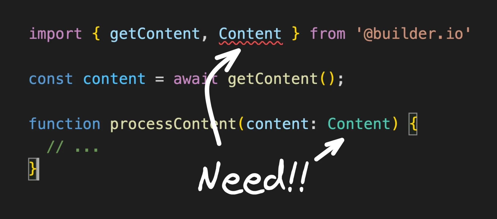

# 📚 TypeScript: breves anotaciones sobre el lenguaje  

Listado personal de anotaciones, trucos, recordatorios, utilidades o ejemplos interesantes para TypeScript.  

 

## Tabla de Contenido
- [Diccionarios](#diccionarios)
- [Mapeando opciones](#mapeando-opciones)
- [Extendiendo la clase Error](#extendiendo-la-clase-error)
- [Utilización de keyof](#utilización-de-keyof)
- [Utilización de Omit](#utilización-de-omit)
- [Utilización de Pick](#utilización-de-pick)
- [Obtener los tipos de una librería de terceros no tipada](#obtener-los-tipos-de-una-librería-de-terceros-no-tipada)
- [Anomalías de TypeScript](#anomalías-de-typescript)
- [@ts-expect-error versus @ts-ignore](#ts-expect-error-versus-ts-ignore)


----------------------------------------------------------
## Diccionarios

* Un ejemplo sencillo de diccionario.

```typescript
type Dictionary = { [key: string]: unknown }; // Puedes usar "type" o "interface"

const user: Dictionary = {
	name: 'John',
	age: 19,
	male: true
}

// TypeScript no te permitirá hacer esto gracias a "unknown"
if (user.age > 25) {
	// ...
}

// te obligará a comprobar si la propiedad existe antes de usarla
if (Object.hasOwn(user, 'age') && typeof user.age === 'number' && user.age > 25) {
  // ...
}
```

* Diccionario protegido contra escritura:

```typescript
interface Dictionary { readonly [key: string]: unknown }; // previene la escrituta con "readonly"

const user: Dictionary = Object.freeze({
	// Object.freeze no es necesario, pero se complementa con "readonly"
	name: 'didi',
	age: 19,
	male: true
})
```

* Combinándolo con genéricos:
```typescript
interface Dictionary<T> { [key: string]: T };

const featureFlagsConfiguration: Dictionary<boolean> = {
	newUserProfilePage: true,
	experimentalFilters: false,
}
```

----------------------------------------------------------  
## Mapeando opciones

```typescript
export enum PersistenceStrategy {
	MYSQL = 'mysql',
	MONGODB = 'mongodb',
	POSTGRESQL = 'postgresql',
}

export const getPersistenceStrategy = (): PersistenceStrategy => {
	const usedPersistenceStrategy = process.env.PERSISTENCE_STRATEGY;

	switch (usedPersistenceStrategy) {
		case PersistenceStrategy.MYSQL:
			return PersistenceStrategy.MYSQL;
			break;

		case PersistenceStrategy.MONGODB:
			return PersistenceStrategy.MONGODB;
			break;

		case PersistenceStrategy.POSTGRESQL:
			return PersistenceStrategy.POSTGRESQL;
			break;

		default:
			return PersistenceStrategy.MYSQL;
			break;
	}
};

export const getDomainOfPersistenceDataLayer = (): string => {
	const domainOfPersistenceDataLayer: Record<PersistenceStrategy, string> = {
		[PersistenceStrategy.MYSQL]: 'https://cloud.mysql.com',
		[PersistenceStrategy.MONGODB]: 'https://atlas.mongodb.com',
		[PersistenceStrategy.POSTGRESQL]: 'https://online.postgresql.com',
	};

	return domainOfPersistenceDataLayer[getPersistenceStrategy()];
};


/**
 * How to use this:
 *
 * process.env.PERSISTENCE_STRATEGY = 'mongodb'; // This should come from the .env file
 *
 * console.log(getDomainOfPersistenceDataLayer());
 */
```

----------------------------------------------------------
## Extendiendo la clase Error

Manera correcta de extender la clase Error en TypeScript: 
```typescript
/**
 * Declare an abstract class. All error classes should extend from this abstract factory.
 *
 * On this example, I added an optional property called "data". You can pass an Object to the constructor to add data to the error instance. Usefull to send data to a logger function or something like that. For example, you can use the property "message" to provide info for developers and use the property "data" to provide info to the API clients.
 */
export abstract class AbstractError extends Error {
	constructor(public readonly message: string, public readonly data?: Record<string, unknown>) {
		super(message);

		/* The next lines are necessary to use methods like 'instanceof' */
		this.name = this.constructor.name;
		Object.setPrototypeOf(this, new.target.prototype);
	}
}

/**
 * An implementation of AbstractError.
 */
export class FooError extends AbstractError {
	constructor(
		public readonly message: string = 'Default message error',
		public readonly data?: Record<string, unknown>,
	) {
		super(message);
	}
}

/**
 * Another implementation of AbstractError.
 */
export class BarError extends AbstractError {
	constructor(
		public readonly message: string = 'Default message error',
		public readonly data?: Record<string, unknown>,
	) {
		super(message);
	}
}

```

----------------------------------------------------------  
## Utilización de keyof

* Ejemplo interesante de _keyof_: 

```typescript
type Person = {
	id: string;
	name: string;
	age: number;
	enabled: boolean;
};

const updateSomePerson = (
	timeSlotId: Person['id'], // allow the id of Person
	keyToUpdate: keyof Person, // allow any property of Person: 'id', 'name', 'age', 'enabled'
	newValue: Person[keyof Person] // allow string, number or boolean!
): void => {
	// ...
};

updateSomePerson('12a3b4c1', 'name', 'john doe');
```

----------------------------------------------------------  
## Utilización de Omit

* Evita hacer una propiedad opcional cuando la propiedad no es válida en un determinado caso. En su lugar, declara 2 tipos separados, y utiliza _Omit_ para evitar copiar/pegar.

Ejemplo: Muchos objetos carecen de id hasta que son guardados. Así que declara un tipo separado para la situación en que ese objeto esta "no guardado":

```typescript
type User = {
	id: number;
	name: string;
	email: string;
}

type UnsavedUser = Omit<User, 'id'>;
```

----------------------------------------------------------  
## Utilización de Pick

* Puedes utilizar _Pick_ para crear typos en base a algunas propiedades de otro tipo. Fíjate que es una alternativa a _Partial_ para cuando si sabemos exactamente que propiedades contendrá nuestro nuevo tipo!

```typescript
type User = {
	age: number;
	gender: string;
	country: string;
	city: string
};

type DemographicUserData = Pick<User, 'age'|'gender'>;
```

----------------------------------------------------------  

## Obtener los tipos de una librería de terceros no tipada


Are you ever building something in TypeScript and realize... AGH! This package is not exporting a type I need!



Fortunately, TypeScript gives us a number of [utility types](https://www.typescriptlang.org/docs/handbook/utility-types.html) that can solve this common problem.

For instance, to grab the type returned from a function, we can use the `ReturnType` utility:

```typescript
import { getContent } from '@builder.io'
const content = await getContent()
// 😍
type Content = ReturnType<typeof getContent>
```

But we have one little problem. `getContent` is an `async` function that returns a promise, so currently our `Content` type is actually `Promise`, which is not what we want.

For that, we can use the `Awaited` type to unwrap the promise and get the type of what the promise resolves to:

```typescript
import { getContent } from '@builder.io'
const content = await getContent()
// ✅
type Content = Awaited<ReturnType<typeof getContent>>
```

Now we have exactly the type we needed, even though it is not explicitly exported. Well, that’s a relief.

But what if we need argument types for that function?

For instance, `getContent` takes an optional argument called `ContentKind` that is a union of strings. I really don’t want to have to type this out manually, so let’s use the `Parameters` utility type to extract its parameters:

```typescript
type Arguments = Parameters<typeof getContent>
// [ContentKind | undefined]
```
`Parameters` gives you a tuple of the argument types, and you can pull out a specific parameter type by index like so:

```typescript
type ContentKind = Parameters<typeof getContent>[0]
```
But we have one last issue. Because this is an optional argument, our `ContentKind` type right now is actually `ContentKind | undefined`, which is not what we want.

For this, we can use the `NonNullable` utility type, to exclude any `null` or `undefined` values from a union type.
```typescript
// ✅
type ContentKind = NonNullable<Parameters<typeof getContent>[0]>
// ContentKind
```
Now our `ContentKind` type perfectly matches the `ContentKind` in this package that was not being exported, and we can use it in our `processContent` function like so:
```typescript
import { getContent } from '@builder.io'

const content = await getContent()

type Content = Awaited<ReturnType<typeof getContent>>
type ContentKind = NonNullable<Parameters<typeof getContent>[0]>

// 🥳
function processContent(content: Content, kind: ContentKind) {
	// ...
}
```

----------------------------------------------------------  

## Anomalías de TypeScript

* Casos extraños trabajando con tuplas y Array.map():

```typescript
type Day = {
	index: number
};

type WeekTuple = [Day, Day, Day, Day, Day, Day, Day]; // Tuple!

const getATuple = (): WeekTuple => {
	const WEEK_DAYS = [1, 2, 3, 4, 5, 6, 7];

	return WEEK_DAYS.map((dayOfWeek): Day => {
		return {
			index: dayOfWeek,
		};
	});
};

/**
 * Este código produce el siguiente error de tipo:
 *
 * El tipo 'Day[]' no se puede asignar al tipo 'WeekTuple'. El destino requiere 7 elemento(s), pero el origen puede tener menos.
 */


/**
 * Sin embargo, no hay ningún error en el código. En este caso, el origen tendrá exactamente los 7 elementos que requiere la tupla.
 *
 * Es importante recordar que las tuplas no existen en JavaScript. TypeScript nos permite trabajar con ellas, pero algunas cosas no están bien resueltas. En este caso, lo que retorna Array.map() no puede ser asignado a una tupla.
 *
 * Más info: https://github.com/microsoft/TypeScript/issues/29841
 */
```

* Cuidado con la inferencia de tipos:

```typescript
/*
 * Observa que estamos usando inferencia de tipos en el retorno de esta función
 */
function foo(size: number) {
	return new Array(size).fill(0);
}

/*
 * Aquí decidimos forzar el tipo de retorno
*/
function bar(): string[] {
	return foo(10);
}

const items = bar();
/*
 * En este punto, TypeScript cree que `items` tiene este tipo `string[]`, pero en realidad `items` contiene esto `number[]`.
 *
 * Si no hubieramos hecho inferencia en la primera función, TypeScript nos hubiera advertido de que la segunda función no retorna un array de strings. Sin embargo, al dejar que haga inferencia en la primera función no nos ha advertido.
 *
 * Fíjate que la inferencia hace que el retorno de la primera función sea `any[]`. Sin embargo, sabemos que el contenido de ese array será siempre un número.
 */
```

* Array.filter tampoco funciona bien:

```typescript
const list = [ 1, 2, 3, undefined];

const result = list.filter(Boolean); // [ 1, 2, 3 ]

/**
 * El tipado de la variable result no es correcto, es: (number | undefined)[]
 */
```

----------------------------------------------------------  

## @ts-expect-error versus @ts-ignore

* Existen dos maneras de suprimir errores en TypeScript: _@ts-expect-error_ y _@ts-ignore_. 

La única diferencia práctica en ambos casos es que _@ts-expect-error_ ignora el error mientras éste exista, pero si el error deja de existir te notifica que quizás ya no necesites esa directiva: `Unused '@ts-expect-error' directive`.

En algunos casos te convendrá usar uno y otros casos preferirás el otro. 

Por ejemplo si estás testeando que una función lanza un error si le pasas un tipo incorrecto, deberías usar _@ts-expect-error_ en el test para que TypeScript te permita llamar a la función pasándole un dato de un tipo equivocado. 

Es importante no confundirse con la directiva _@ts-nocheck_, la cual permite desactivar las comprobaciones de tipado en todo el fichero si se coloca en la primera linea del mismo!

```typescript
const isOptionEnabled = (key: string): boolean => {
  // @ts-expect-error: if key isn't in globalOptions it'll be undefined which is false
  return !!globalOptions[key];
};
```

----------------------------------------------------------  

